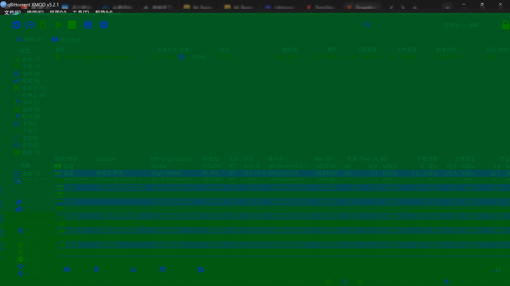
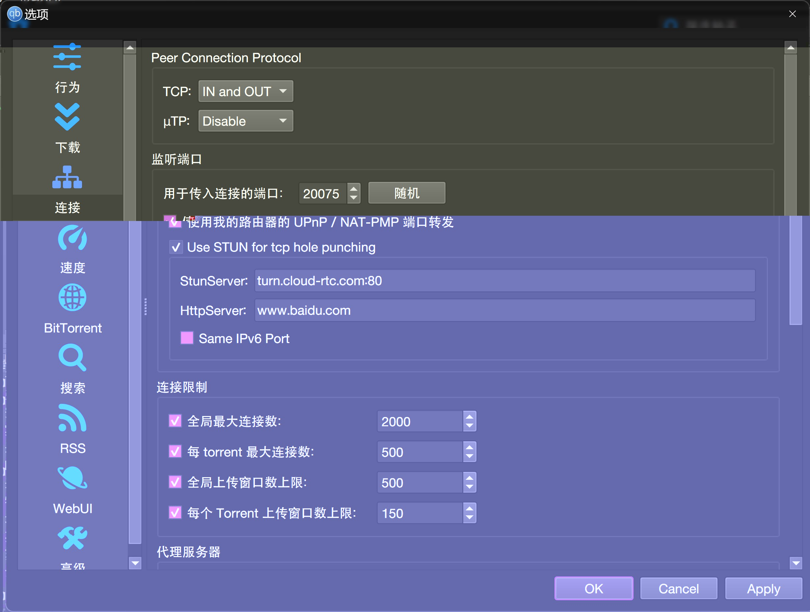

> **声明：** 本项目为个人自用的 qBittorrent 定制修改版，实现 基于 STUN 的TCP打洞 与 Peer 信息增强。标题栏已更名为 `qBittorrent XMOD` 以示区别。

---

## ✨ 核心新增功能

### 1. STUN 打洞（TCP Hole Punching）
* **原理：** 集成 STUN 协议，在运营商 **NAT1** 环境下实现原生 TCP 打洞。
* **可调参数：**
    * STUN 服务器地址
    * HTTP 服务器地址（用于长连接维持，防止端口映射失效）
    * **端口对齐：** 支持强制让 IPv6 端口与 IPv4 映射后的端口保持一致。

### 2. 增强版 IP 精准定位（MaxMind + 国内定制库）
* **界面升级：** Peer 列表新增 `Location`（地理位置）和 `ISP/Organization`（网络运营商/组织）两列。
* **视觉优化：** 保留原有国家国旗图标的同时，同步直观展示国家名称。
* **数据源：** 弃用原版的 DB-IP，全面替换为 **MaxMind GeoLite2**（City/ASN 库）及 [**GeoCN**](https://github.com/ljxi/GeoCN) 国内高精度库。

### 3. Peer 连接质量深度扩展
* **Peer DL Speed**：实时估算并显示对方在该种子下的**实际下载速度**。
* **RTT（往返时延）**：显示与 Peer 之间的网络延迟（毫秒）。*（注：部分场景下可能存在统计偏差，数值仅供参考）*

### 4. 集成 Nexttrace 路由追踪
* **技术支持：** 基于 [Ntrace-core](https://github.com/nxtrace/NTrace-core) 强力驱动。
* **快捷操作：** 在 Peer 列表中右键点击任意 IP，即可在右键菜单中一键触发 `Trace IP`，系统将弹窗新终端并自动执行路由追踪。

### 5. 状态栏外部 IP 探针与在线测试
* **双栈对齐：** 左下角状态栏同步展示公网 **IPv4 / IPv6 地址及当前端口**（示例：`1.2.3.4:12345`）。
* **一键测速：** 右键点击外部 IP 标签，可快速跳转至国内主流 TCP 端口检测网站，方便验证端口是否成功开放：
    * [itdog](https://www.itdog.cn/) | [ping.pe](https://ping.pe/) | [antping.com](https://antping.com/)

### 6. 自定义身份（Peer ID / User-Agent）
* **个性化定制：** 支持在高级设置中手动修改 `Peer ID`（最大 8 字节 ASCII）和 `HTTP User-Agent`。
* **生效机制：** 动态修改，即时对新连接生效。
* ⚠️  **对私有种子（Private Torrent）会自动强制禁用此功能**。

### 7. 精细化协议独立管理（TCP / μTP 分离）
打破原有“TCP+μTP”捆绑开关的限制，将其拆分为 **TCP 协议** 与 **μTP 协议** 两个独立控制项。

| 可调策略 | 行为说明 |
| :--- | :--- |
| `IN and OUT` | 允许完整的入站和出站连接 |
| `IN only` | 仅允许入站连接（被动连接） |
| `OUT only` | 仅允许出站连接（主动连接） |
| `Disable` | 完全彻底禁用该协议 |

### 8. 其他
*  移除内置的程序自动更新检查。
* **未完全同步：** WebUI 暂时不支持上述所有的协议控制新选项。

---

## 🚀 快速上手指南

> 💡 **小贴士：** 所有新添功能均支持**热重载**，可在运行中动态开启/关闭，**无需重启** qBittorrent。

### A. 基础功能使用手册

1.  **开启 STUN 打洞**
    * 前往：`工具` ➔ `设置` ➔ `连接` ➔ 勾选 `Use STUN for tcp hole punching`。
    * *查看日志：* 勾选 `视图` ➔ `日志` ➔ `显示`，即可监控打洞状态。
2.  **解锁 Peer 增强列**
    * 进入任意下载任务的 `Peer` 标签页，**右键点击表头**，勾选：`Location`、`ISP/Organization`、`Peer DL Speed`、`RTT`。
3.  **执行路由追踪**
    * 在 Peer 列表中右键选中目标 IP ➔ 点击 `Trace IP` ➔ 系统自动调用并运行 `nexttrace-tiny <IP>`。
4.  **快捷端口外网测试**
    * 观察左下角 `External IPs: x.x.x.x:port` ➔ **右键点击该区域** ➔ 选择任意测试平台即可直链跳转。
5.  **自定义身份**
    * 前往：`工具` ➔ `设置` ➔ `高级` ➔ 找到 `PeerID custom` 和 `UserAgent custom` 输入框进行配置。
6.  **精细化协议控制**
    * 前往：`工具` ➔ `设置` ➔ `连接` ➔ `Peer Connection Protocol`，分别针对 TCP/μTP 设定策略。

### B. 🔥 运营商 NAT1 用户推荐配置
> **前提条件：** 仅要求你的宽带运营商网络环境为 NAT1，不强制要求路由器支持 NAT1。

* **步骤一：** 进入 `工具` ➔ `设置` ➔ `连接` ➔ `Peer Connection Protocol`，将 **TCP** 设为 `IN and OUT`，将 **μTP** 设为 `Disable`。
* **步骤二：** 勾选 `Use STUN for tcp hole punching`，下方子选项全部保持默认。
* **步骤三：** 勾选 `使用我的路由器的 UPnP / NAT-PMP 端口转发`（需确保路由器已开启 UPnP 开关）。*当然，在路由器上手动做端口映射或开启 DMZ 效果更佳。*

---

## 🖼️ 界面展示

*图 1：主界面与状态栏增强信息展示*

*图 2：设置面板*

---

## 📝 核心备注与环境说明

* ⚙️ **底层依赖：** 本修改版深度依赖 **魔改版 libtorrent**（未开源），与官方原版 libtorrent 不兼容。
* 📂 **便携化/绿色化：** 如果你想将本版本的数据与官方原版 qBittorrent 彻底隔离，只需**在 `qbittorrent.exe` 所在的同级目录下新建一个名为 `profile` 的文件夹**，程序便会自动将所有数据重定向至该目录。
* 🌐 **自动下载与更新组件：**
    * `Nexttrace` 工具在首次调用时，会自动下载至 `%LocalAppData%\qBittorrent\Nexttrace` 目录。
    * 高精度 IP 数据库文件（`.mmdb` / `.txt`）默认存储于 `%LocalAppData%\qBittorrent\GeoDB` 目录。
    * 上述组件默认**每 30 天**会从 GitHub 尝试自动检查并下载更新，请确保网络链路畅通。
* ❌ **彻底卸载：** 直接删除 `qbittorrent.exe` （如创建了 `profile`，一并删除该文件夹即可实现零残留），可选删除`%LocalAppData%\qBittorrent\Nexttrace`和`%LocalAppData%\qBittorrent\GeoDB`文件夹。